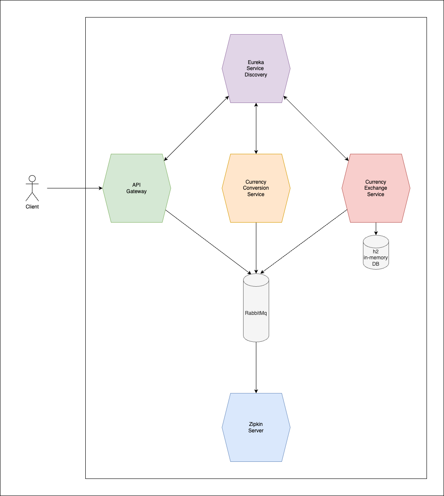

# learning_microservices

This is a learning project based on a Udemy course by "in28minutes".

# Basic Architecture

The architecture consists of 4 Microservices:
- Eureka Discovery Service (Naming Server)
- Currency Conversion Service
- Currency Exchange Service (with h2 in-memory Database)
- Zipkin Server (for Tracing)

An Api Gateway:
- Spring Cloud Api Gateway

A Message Broker:
- RabbitMq 




# How to Build
## Requirements: 
 - Docker
 - Docker Compose

### 1. Run the application with Pre-build Containers (for M1-Architecture):
``` 
$ cd ./Docker/preBuild
$ docker-compose up
```

### 2. Build the Images and Run the Containers with:
```
$ cd ./Docker/build
$ docker-compose up
```

## URLs

| Application            | URL                                       | Example                                                                 |
|------------------------|-------------------------------------------|-------------------------------------------------------------------------|
| Eureka                 | http://localhost:8761                     |                                                                         |
| API Gateway            | http://localhost:8765                     | http://localhost:8765/currency-conversion/from/EUR/to/PLN/quantity/899  |
| Currency Conversion MS | http://localhost:8100/currency-conversion | http://localhost:8100/currency-conversion/from/EUR/to/PLN/quantity/899  |
| Currency Exchange MS   | http://localhost:8000/currency-exchange   | http://localhost:8000/currency-exchange/from/EUR/to/PLN                 |
| RabbitMq               | http://localhost:15672                    |                                                                         |
| Zipkin                 | http://localhost:9411                     |                                                                         |

