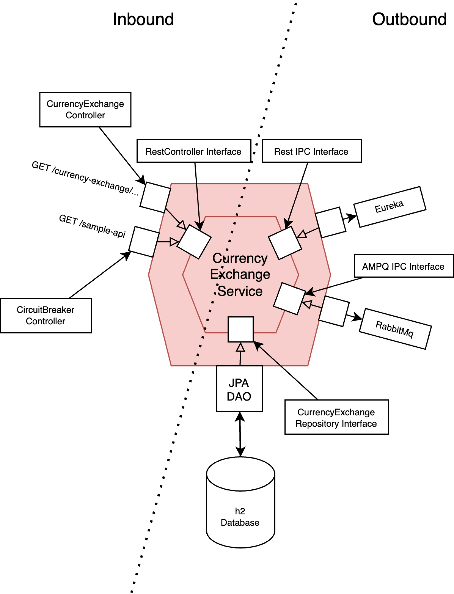

# Currency Exchange Service

## Description

The Currency Exchange Service is a Microservice implemented in the Java Spring Boot Framework, for learning purposes.

## Architecture

### Business Logic:
 - consists of a CurrencyExchange Entity with its respective constructor, getters and setters

### Inbound: 

#### Ports:

- RestController Interface provided by Spring Web

#### Adapters:
 
- CurrencyExchangeController exposes: 
  - GET /currency-exchange/from/{from}/to/{to} which invokes the method:
    - retrieveExchangeValue(String from, String to)
    
- a dummy CircuitBreakerController (for investigation purposes) exposes:
  - GET /sample-api which invokes the method:
    - sampleApi() 

### Outbound:

This microservice is provided by the Eureka-Client Dependency, that invokes a Registration on the Eureka Naming Server, 
which serves as a Service Discovery\
It also is provided by the Spring-Rabbit dependency, to send logs via the amqp Messaging Protocol to RabbitMq.

Furthermore it has additional ports and adapters:

#### Ports:

- CurrencyExchangeRepository Interface (extending JpaRepository) that provides an operation of type Query: 
  - findByFromAndTo() 

#### Adapters:

- Managed by JPA for Query Operations on H2-Database

